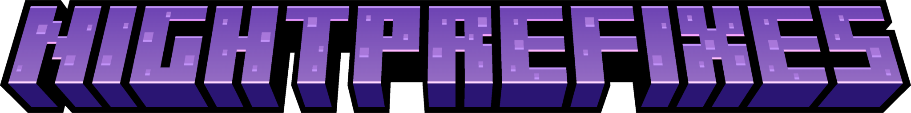

<center>

<p><b>NightPrefixes</b> - Paper plugin for custom prefixes!</p>

<u>English</u> | <b><a href="README_RU.md">Russian</a></b>
</center>

***

# 🚀 Features

- **Cache** for placeholders
- Admins can block player to changing prefixes
- Length limit
- Custom prefix if not set
- **HEX Codes** by MiniMessage support

# 💾 Requirements

- Java **17+**
- Paper (or forks such as Purpur) **1.18+** <u>(not Spigot/CraftBukkit)</u>

# ⚡ Commands and permissions

## /nightprefixes

> [!TIP]
> Aliases: **/nightprefix**, **/nprefix**, **/np**, **/prefix**

#### Admin usage:
- **/nightprefixes admin reload** - Reload plugin
    - Permission: `nightprefixes.admin.reload`
- **/nightprefixes admin reset player** - Reset player's prefix
    - Permission: `nightprefixes.admin.prefix.reset`
- **/nightprefixes admin ban player** - Block player ability to change prefix
    - Permission: `nightprefixes.admin.ban`
- **/nightprefixes admin unban player** - Block player ability to change prefix
    - Permission: `nightprefixes.admin.unban`

#### Player usage:
- **/nightprefixes set prefix** - Set prefix
    - Permission: `nightprefixes.player.prefix.set`
- **/nightprefixes reset** - Reset prefix
    - Permission: `nightprefixes.player.prefix.reset`

# 🌐 Translations (#todo)

At the moment the plugin is available in Russian only

# 📜 Metrics

You can check statistic about this plugin [here](https://bstats.org/plugin/bukkit/NightPrefixes/23404) and disable sending in `config.yml` by setting `enable-metrics: false`


***


# ⚙ Other information

### If you find a bug or want to help with development, feel free to contact me
- Contact links [here](https://drakoshaslv.ru/)

### You can also (optionally) donate me:
- [DonationAlerts](https://www.donationalerts.com/r/mrdrag0nxyt)
- TON:
  ```
  UQAwUJ_DWQ26_b94mFAy0bE1hrxVRHrq51umphFPreFraVL2
  ```
- ETH:
  ```
  0xf5D0Ab258B0f8EeA7EA07cF1050B35cc12E06Ab0
  ```


<center><h3>Made specially for <a href="https://nshard.ru">NightShard</a></h3></center>